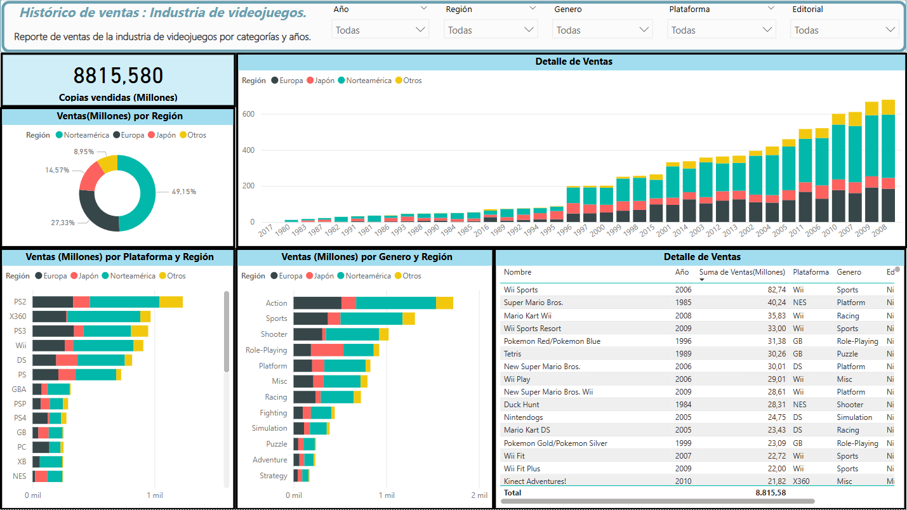

## 📊 Visualización del histórico

### Para trabajar/testear este proyecto, descargar y abrir con Power Bi Desktop o su versión web.

# Dashboard de Histórico de Videojuegos (Proyecto End-to-End)

## Descripción del Proyecto
Este es un proyecto de portfolio que demuestra el ciclo de vida completo de los datos, desde la extracción inicial hasta la visualización interactiva. Utilizando un conjunto de datos sobre ventas históricas de videojuegos, se gestionó todo el proceso para transformar datos crudos en un dashboard de Business Intelligence funcional y perspicaz.

El objetivo es demostrar un entendimiento práctico de las distintas etapas que componen un proyecto de datos, cubriendo competencias tanto de **Data Engineering** como de **Data Analysis**.

---

## Herramientas y Habilidades Demostradas

### Fase de Ingeniería de Datos (Preparación)
*   **Extracción y Transformación (ETL):** Uso de **Power Query** para realizar operaciones de limpieza, fusión, formateo y enriquecimiento de los datos, preparándolos para el análisis.
*   **Modelado de Datos:** Creación de un modelo de datos relacional (esquema en estrella) para asegurar la integridad, el rendimiento y la eficiencia de las consultas.

### Fase de Análisis y Visualización
*   **Business Intelligence (BI):** Aplicación de principios de inteligencia de negocio para desarrollar un dashboard en **Power BI**.
*   **Análisis con DAX:** Creación de métricas, KPIs y columnas calculadas complejas con DAX (Data Analysis Expressions) para responder a preguntas de negocio.
*   **Visualización y Storytelling:** Diseño de un panel interactivo y fácil de usar, seleccionando los gráficos adecuados para comunicar los hallazgos de forma efectiva.

---

## Contenido del Dashboard
El análisis incluye, entre otros, visualizaciones sobre:
*   Ventas totales por género, plataforma y región.
*   Evolución histórica de las ventas.
*   Rendimiento de los principales editores (publishers).
